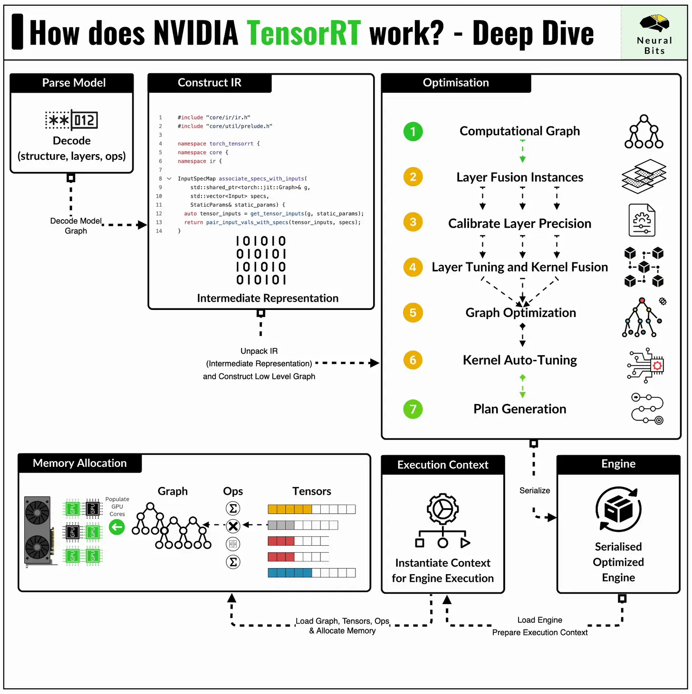

# Profilling Inference Engines
In this tutorial, we'll profile a MobileNet v2 CNN model on the following engines:
| Engine Name | Format | Device | Details|
|-------------|--------|--------|--------|
|Raw PyTorch | .pt | CUDA | |
|PyTorch 2.0 Compile | .pt | CUDA| Optimized using JIT auto-tune with torchdynamo backend|
|ONNXRuntime| .onnx | CUDAExecutionProvider | Default graph optimizations from ONNXRuntime are applied |
|TensorRT | .engine | C CUDA Kernels | TensorRT 23.03 Docker Container Version| 



### Here's what we'll learn:
- About MobileNet v2 Architecture
- Visualize model architectures using TorchViz and Netron (ONNX)
- What happens under the hood when you use torch.compile()
- How to export and optimize .pt models to .onnx formats.
- How to export and optimize .onnx models to TensorRT .engine.
- How to profile each model version
- About low-level TensorRT GPU memory management using c_api wrappers

---
### Resources
- 📝 [Inference Engines profilling MobileNetv2]()

### Dependencies
- [Python (version 3.11)](https://www.python.org/downloads/)
- [Poetry (version 1.7.1)](https://python-poetry.org/)
- [GNU Make](https://www.gnu.org/software/make/)
- [Docker](https://www.docker.com/)

## Misc
The hardware setup used during this project:
- GPU : RTX 4080
- CPU : Intel Core i9-13900k

The key NVIDIA software versions to ensure portability:
- CUDA : v12.2
- Driver Version: v535.183.01

## Install

```First, let's install the nvidia-docker runtime that will allow the interface between docker containers and the underlying HW of the PC. In this case, the NVIDIA GPU.```

As we use Make and Poetry to manage the project, to install the project, you have to run the following:
```shell
make install_nvidia_container_runtime
```

Next, install the project env and the jupyter kernel using:
```shell
make install
```

### Usage
In your jupyter notebook, select the newly created env, should be named `py311_inference_engines` and start iterating the description + code blocks within the notebook.