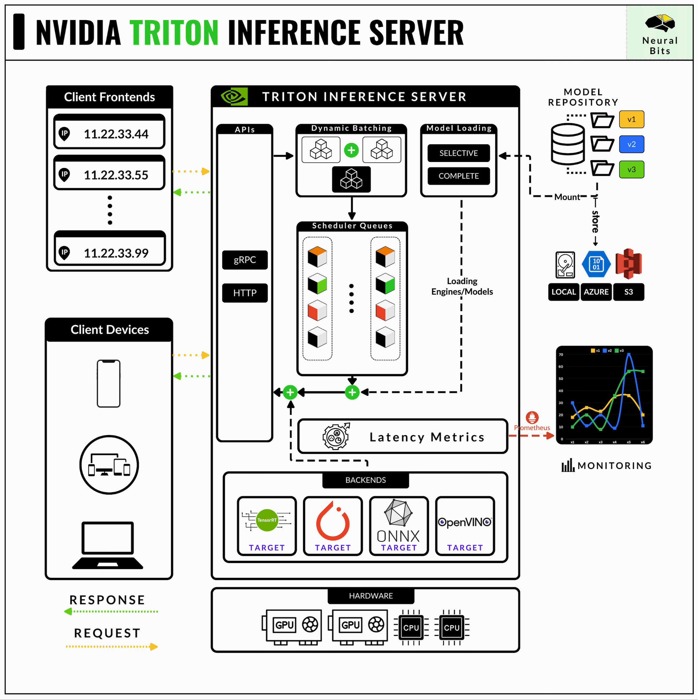

# Deploy Deep Learning Models at Scale using NVIDIA Triton Inference Server

NVIDIA Triton Inference Server is a powerful framework used at large in production environments to handle model serving.
In this article, we'll go over how to prepare,set,serve and use a Image Classification (MobileNetV2) model deployed within the Triton Inference Server.




**Here's what we'll learn**

- what is NVIDIA Triton Inference Server
- how to download and prepare a model
- how to write the configuration file for the model
- how to start the Triton Inference Server via docker-compose
- how to use a Makefile to automate processes
- how to connect to the server and perform inference using the HTTP protocol
- how to pre-process/post-process the inputs/outputs from the server

### Resources
- 📝[Full Blog Article](https://neuralbits.substack.com/p/how-to-use-nvidia-triton-server-the)

---

## Table of Contents
  - [Dependencies](#dependencies)
  - [Install](#install)
  - [Usage](#usage)
------

### Dependencies
- [Python (version 3.11)](https://www.python.org/downloads/)
- [Poetry (version 1.7.1)](https://python-poetry.org/)
- [GNU Make](https://www.gnu.org/software/make/)
- [Docker](https://www.docker.com/)


### Install

> **_NOTE:_** First, let's install the nvidia-docker runtime that will allow the interface between docker containers and the underlying HW of the PC. In this case, the NVIDIA GPU.
> - As we use Make and Poetry to manage the project, to install the project, you have to run the following:
  ```shell
  make install_nvidia_container_runtime
  ```


Next, install the project dependencies using:
```shell
make install
```

And setup the .env file to handle a few masked variables:
```shell
make fix_env
```


### Usage

Let's start the NVIDIA Triton Server, using the makefile command:
```shell
make start_tis
```

Next, let's run the client which will take an image of a pizza and send it to the Server to perform inference:
```shell
python src/client.py
```
